# Secure Private Infrastructure Deployment with Bastion Access and IAM Role-Based Architecture

##  Project Overview

This project demonstrates a secure AWS infrastructure where:

- Application servers run in private subnets
- No public IP is assigned to backend servers
- Access is allowed only via Bastion Host
- IAM Roles are used instead of access keys
- Proper network isolation is enforced

---

#  Architecture Diagram

.png)
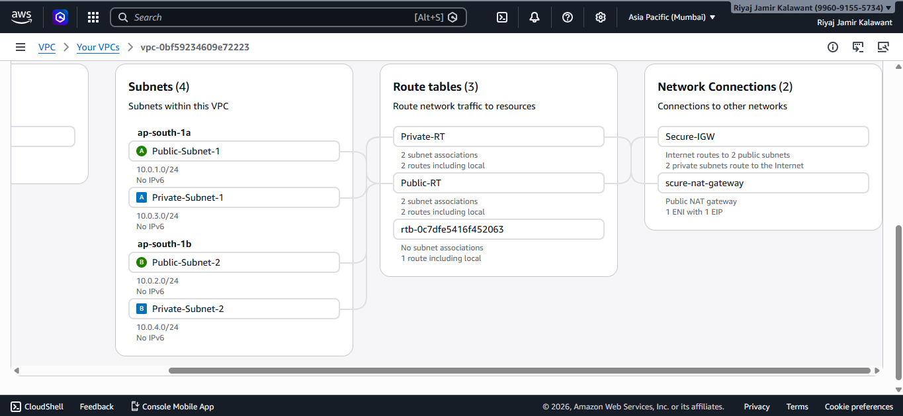

The architecture includes:

- 1 Custom VPC
- 2 Public Subnets
- 2 Private Subnets
- Internet Gateway
- NAT Gateway (in Public Subnet)
- Bastion Host
- Private Application Server

Traffic Flow:

User → Internet → IGW → Bastion → Private EC2  
Private EC2 → NAT Gateway → Internet

---

#  Network Configuration

## Public Route Table

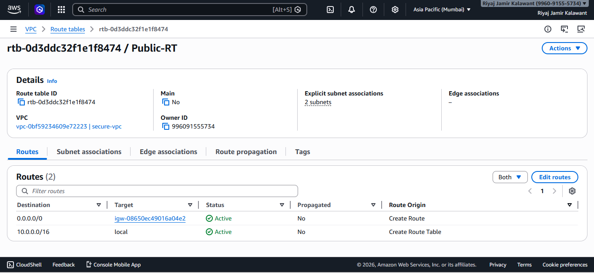

0.0.0.0/0 → Internet Gateway

---

## Private Route Table

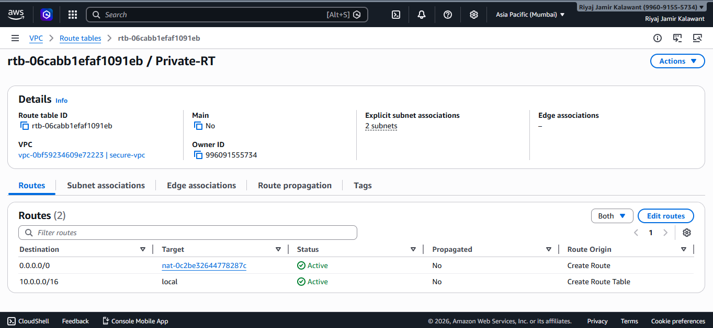

0.0.0.0/0 → NAT Gateway

---

#  Security Groups Configuration

## Bastion Security Group

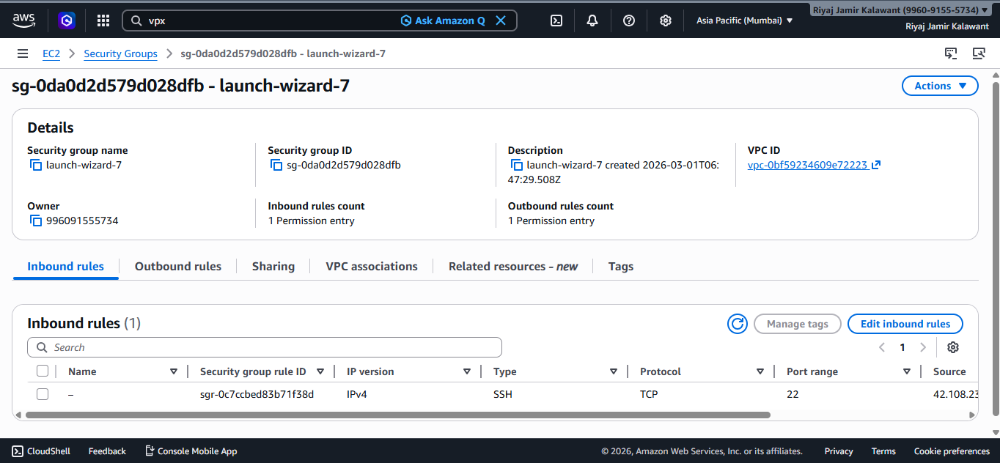

- SSH (22) allowed only from my IP
- All outbound allowed

---

## Private EC2 Security Group

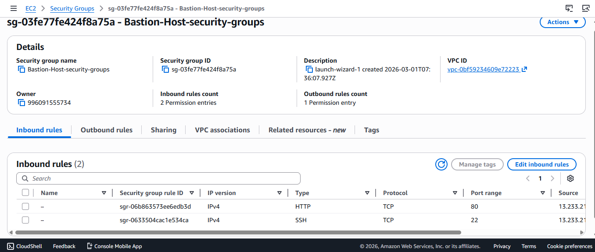

- SSH (22) allowed only from Bastion Security Group
- HTTP (80) internal only

---

#  Security Validation

## Direct SSH from Local Machine (Blocked)

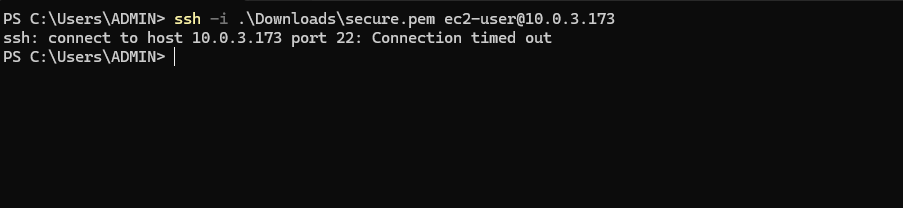

Private instance is not accessible directly from the internet.

---

## Bastion to Private EC2 Access (Successful)

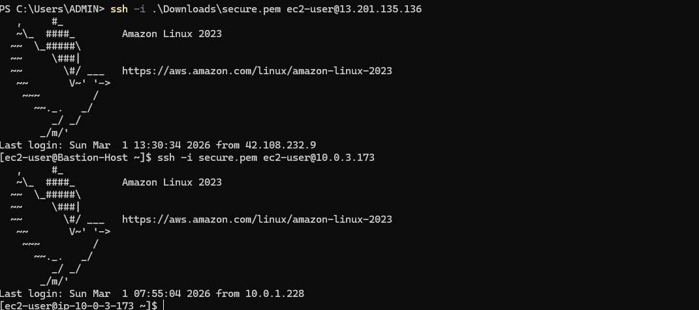

Access is only possible through Bastion Host.

---

#  IAM Role Implementation

## IAM Role Attached to EC2

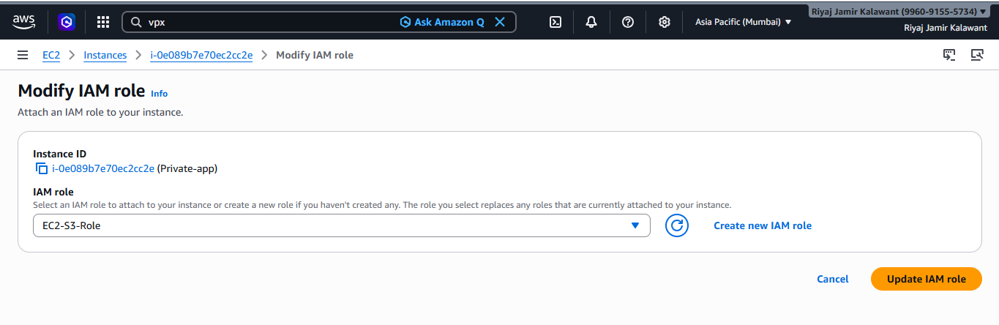

- EC2-S3-Role attached
- AmazonS3ReadOnlyAccess policy

---

## Bastion-Host details
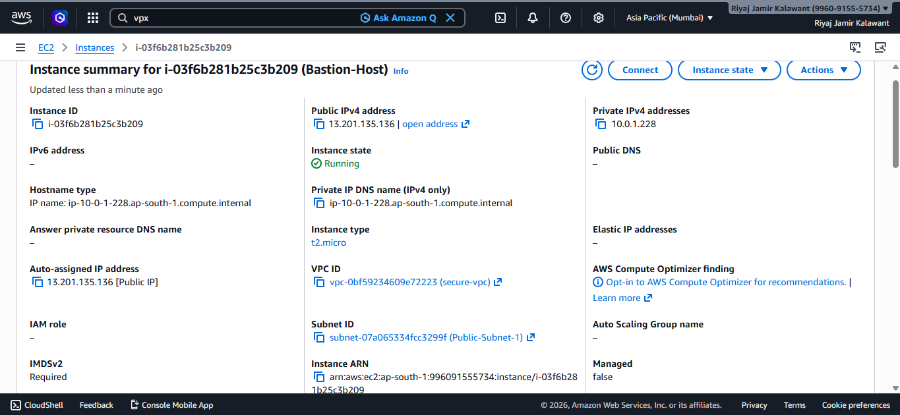

---

## Private-app details
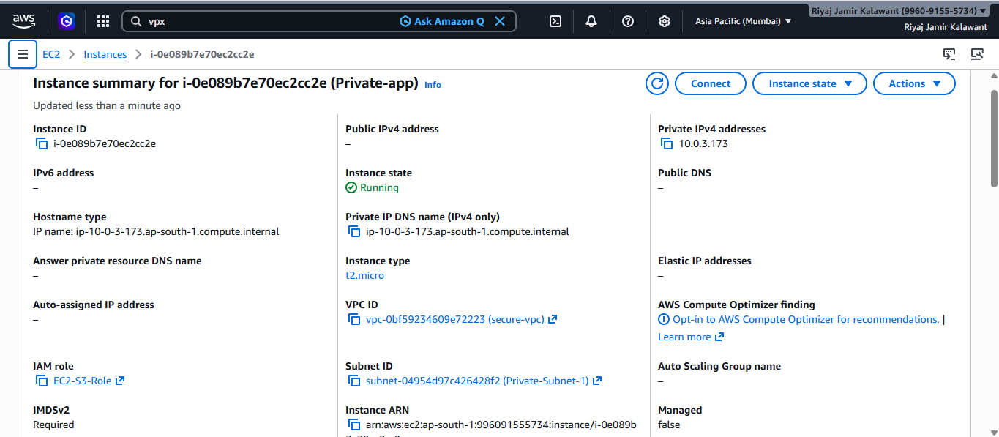

- Not assined public ip
---
## S3 Access without Access Keys

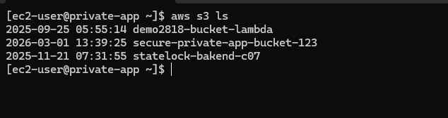

AWS CLI successfully lists S3 buckets using IAM role.
No credentials stored inside the server.

---

#  Architecture Explanation

Backend application servers are deployed inside private subnets without public IP addresses. 

Administrative access is controlled through a Bastion Host deployed in a public subnet.

Outbound internet traffic from private instances is routed through a NAT Gateway.

IAM Roles are used to securely grant AWS permissions without using access keys.

---

#  Security Design Decisions

- No public IP for backend servers
- Least privilege IAM policy
- SSH restricted to specific IP
- No hardcoded credentials
- Separate route tables for isolation
- NAT Gateway for controlled outbound access

---

#  Lessons Learned

- Importance of subnet isolation
- NAT vs Internet Gateway difference
- IAM Roles improve security
- Security Groups act as firewalls
- Bastion Host improves access control
- Following least privilege reduces attack surface

---

#  Project Structure

```
Project/
 ├── README.md
 ├── Screenshots/
 │     ├── Architecture.png
 │     ├── Public-Route-Table.png
 │     ├── Private-Route-Table.png
 │     ├── Bastion-SG.png
 │     ├── Private-SG.png
 │     ├── Direct-SSH-Fail.png
 │     ├── Bastion-to-Private.png
 │     ├── IAM-Role.png
 │     ├── S3-Access.png
```

---

#  Project Status

✔ Secure Infrastructure Implemented  
✔ Bastion-based Access Control  
✔ IAM Role Based Authentication  
✔ Production-Level Security Architecture  